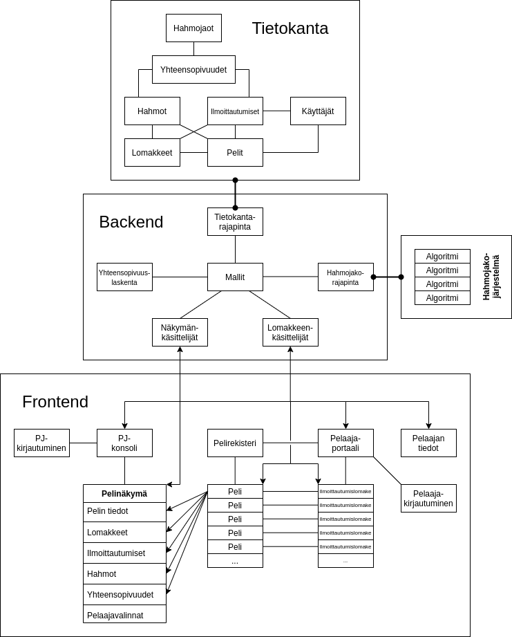

# LARP-portaali

## Esittely
LARP-portaali on verkkosovellus, joka tarjoaa liveroolipelien (LARP) järjestäjille ja osallistujille helppokäyttöisen ja tarkoitusta varten suunnitellun ympäristön pelien ilmoittautumisten ja hahmojakojen toteutukseen ja hallintaan. Sovellus tarjoaa peleihin liittyvän tiedon tarkasteluun ja käsittelyyn erilliset käyttöliittymät pelinjärjestäjille ja pelaajille. Pelinjärjestäjän käyttöliittymän kautta on mahdollista tarkastella, määritellä, laskea ja hallinnoida peliin liittyviä tietoja, kuten pelin julkisia tietoja, sen hahmoprofiileja, ilmoittautumislomaketta, ilmoittautumisia ja hahmojakoon liittyviä tilastotietoja. Pelaajan käyttöliittymän kautta on mahdollista tarkastella tarjolla olevia pelejä ja niihin liittyviä julkisia tietoja sekä täyttää pelien ilmoittautumislomakkeita ja tarkastella ilmoittautumiseen liittyviä tilannetietoja.

## Osat ja yleinen rakenne
Ohjelmisto koostuu erillisestä palvelimella ajettavasta backend-osasta, joka vastaa sovelluksen tietoihin liittyvistä malleista, tiedon välittämisestä tietokannan ja käyttöliittymän välillä sekä hahmojakoon liittyvästä asynkronisesti tapahtuvasta laskennasta, sekä käyttäjän selaimella ajettavasta frontend-osasta, joka vastaa sovelluksen tietojen esittämisestä käyttäjälle ja käyttäjän syöttämien tietojen välittämisestä palvelimelle. Lisäksi sovelluksen backend-osa sisältää rajapintoja erillisiä myöhemmin toteutettavia lisäkomponentteja varten, kuten rakennekaaviossa näkyvä (erikseen toteutettava) hahmojakolaskentamoduuli. Sovelluksen taustalla toimii tietokanta (kehityksen alussa yksinkertainen JSON-tietokanta, lopullisessa versiossa SQL-tietokanta), jonka kanssa sovelluksen backend-osa kommunikoi erillisen tallennusrajapinnan kautta, joka mahdollistaa tietokanta-arkkitehtuurin helpon vaihtamisen.

## Backend

## Frontend

